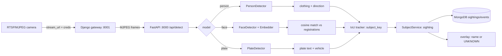
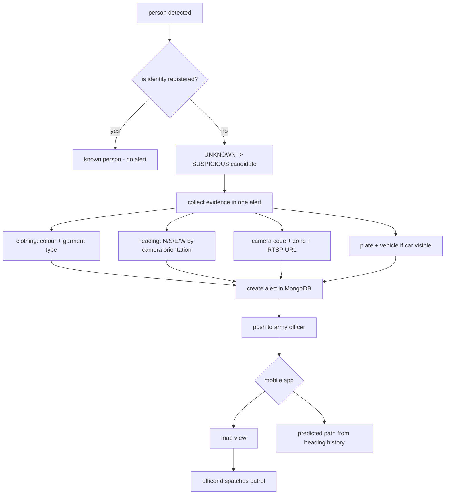
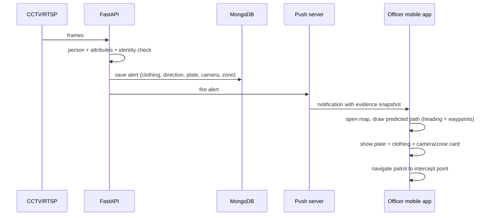

z# pixel-intelligence — AI Border Sentinel

A **defence idea turned into a working CPU-only prototype**: point any camera
(webcam, phone IP-webcam, or a real **RTSP CCTV** camera) at a border zone and
the platform watches it continuously. The moment a person appears who is
**not registered** in the known-persons database, an **alert is fired to the
army officer in charge** with:

- **what the person is wearing** (colour + garment type, top and bottom)
- **where the person is heading** — compass **N / S / E / W** corrected for the
  camera's own orientation
- **which camera/zone** the person was seen in (via the connected **RTSP URL**)
- **vehicle context** — if a car is involved, the **number plate** + vehicle
  colour/type via automatic number-plate detection
- the alert reaches the officer's **mobile app**, which shows a **map with the
  predicted path** the intruder will likely take.

---

## 1. The idea in one paragraph

> Think of a sentry who never blinks. Every camera the base controls —
> fixed CCTV, a phone-cam, a watchtower RTSP camera — streams into this
> system. A lightweight AI (running on a normal laptop, no GPU) detects
> every person, reads what they are wearing, tracks which compass direction
> they are walking, and reads car number plates. Everything "known" — soldiers,
> staff, registered visitors, authorised vehicles — has a face/plate stored in a
> local database. Anyone **unknown** is a _suspicious person_: an alert is
> pushed to the officer on duty with a photo, clothing, heading, camera, zone
> and plate details, plus a **predicted movement path drawn on a map** on the
> officer's phone. Patrols know where to look before the intruder gets there.

This README is written for **teammates**: what is already built, what the idea
adds, how every part talks to every other part, and where each module lives.

---

## 2. Built today vs. the idea (status map)

| Capability                                                      | Status                     | Where                                           |
| --------------------------------------------------------------- | -------------------------- | ----------------------------------------------- |
| Camera registry (name, zone, RTSP/MJPEG URL, creds)             | ✅ built                   | FastAPI + `cameras` collection                  |
| Connect / TEST any RTSP or MJPEG URL before saving              | ✅ built                   | `POST /api/cameras/test` (bounded 9s probe)     |
| Stream a connected camera live into the console                 | ✅ built                   | Django gateway `:8001/video/?camera=…`          |
| Person detection (box)                                          | ✅ built                   | YOLOv8n COCO (or face→body fallback)            |
| Clothing details (colour, garment type, top & bottom)           | ✅ built                   | `attributes.clothing`                           |
| Heading N/S/E/W from movement                                   | ✅ built (screen-relative) | `attributes.direction`                          |
| Identifying **known** people by face                            | ✅ built                   | ArcFace ONNX vs registrations (histogram fallback)     |
| Number-plate detection + vehicle colour/type                    | ✅ built                   | OpenCV morphology + template OCR                |
| **Suspicious = not registered** gating                          | ⚠️ idea — wire it up       | new rule in subject pipeline                    |
| **Alert** to the army officer (payload above)                   | ⚠️ idea — build it         | new `alerts` module                             |
| **Mobile app** on officer's phone with **map + predicted path** | 🚧 idea — build it         | new mobile/web-push surface                     |

> The detection layer is real and testable _today_. The remaining work is the
> decisioning + alerting + mobile layer described in §6–§7.

---

## 3. System architecture

```
┌─────────────┐   ┌────────────┐   ┌─────────────┐   ┌─────────────┐
│  CAMERAS     │   │  Next.js    │   │  Django      │   │  FastAPI     │
│  RTSP/MJPEG  │   │  UI  :3000  │   │  gateway     │   │  :8000       │
│  webcam/phone│─►│  (routes    │──►│  :8001       │──►│  AI ingests  │
└─────────────┘   │   proxy)    │   │  (MJPEG out) │   │  per frame   │
                  └─────────────┘   └─────────────┘   └──────┬───────┘
                                                              │
                                              ┌────────────┐  │  reads/writes
                                              │  MongoDB   │◄─┘  registrations,
                                              │   :27017   │     sightings, cameras,
                                              └────────────┘     subjects, counters
```

| Port    | Service | Job                                                                  |
| ------- | ------- | -------------------------------------------------------------------- |
| `27017` | MongoDB | Single source of truth: registrations, sightings, subjects, cameras  |
| `8000`  | FastAPI | Detection, identity, analytics, camera registry REST API             |
| `8001`  | Django  | Opens the camera (webcam/RTSP/MJPEG), streams MJPEG, forwards frames |
| `3000`  | Next.js | Web UI: console, cameras, register, analytics, events                |

**Frame flow (console page)**: Next `:3000` → Django `:8001/video/?camera=X`
(MJPEG stream) → Django forwards every _Nth_ frame (default every 3rd) to
FastAPI `POST /api/detect` → detections + attributes are returned, drawn on the
stream, and stored in Mongo. Registered identity → name on the overlay; unknown
→ flagged.

---

## 4. The full pipeline (flow charts)

### 4.1 Camera → detection → sighting



### 4.2 Suspicious-person alert pipeline (the idea)



### 4.3 Alert delivery → mobile map (the idea)



---

## 5. Evidence the system extracts per sighting

### 5.1 What the person wears (`attributes.clothing`)

`backend/app/detection/clothing.py` — no extra model, pure colour-zone +
geometry heuristics on the person box (head strip removed, torso vs legs split):

```json
{
  "colour": "black",
  "top_colour": "black",
  "bottom_colour": "grey",
  "type": "jacket + trousers",
  "confidence": 0.72
}
```

Garment types include `dress / kurta`, `hoodie + trousers`, `tracksuit`,
`shirt + trousers`, `t-shirt + trousers` etc. Tiny/distant crops report
`unknown` rather than a wrong guess.

### 5.2 Where the person is heading (N/S/E/W)

`backend/app/detection/direction.py` — a rolling window (8 points) of the
tracked bbox centre is fit for drift; the dominant axis becomes a compass label
(`E`, `S`, `N`, `W`, or `UNKNOWN` when standing still).

> **Idea → camera-relative truth (proposed):** today the label is
> _screen-relative_. The idea adds a **camera orientation field** (e.g.
> `compass_forward` on each camera record, set at install time) so the
> screen heading is rotated into a real-world bearing:
> `world_heading = (screen_heading + camera_forward) mod 360`.
> That single field makes "heading N" mean actual north for patrols.

### 5.3 Cars & number plates (`attributes` on plate detections)

`backend/app/detection/plate_detector.py`:

```json
{
  "plate_text": "PB08 1234",
  "ocr_confidence": 0.83,
  "vehicle_type": "car",
  "vehicle_colour": "white"
}
```

- Plate **found** via OpenCV morphology + contour candidates (no weights needed);
- Plate **read** via tesseract LSTM OCR (`sudo apt install -y tesseract-ocr`;
  falls back to a bundled Pillow-rendered template matcher when absent);
- Vehicle **type/colour** attributed from the COCO object model
  (`_VEHICLE_IDS = {2 car, 3 motorcycle, 5 bus, 7 truck}`) nearest to the plate.

### 5.4 Identity — who is "known"

`backend/app/detection/face_embedder.py` — identity matching uses the ArcFace
ONNX embedder (`models/arc_face.onnx`, via onnxruntime) when present (512-dim,
same-person cosine ≈0.90, different-person <0.45); otherwise it falls back to a
lighter 64-dim histogram embedder. The **Register** tab can capture 3–5
reference frames directly from the browser webcam (or accept uploaded photos),
then sends them to `POST /api/registrations` with the person details. Existing
enrolments are re-embedded automatically when the ONNX embedder first turns on.

A live face is only **named** when all of these hold — deliberately defensive so
an unregistered stranger stays **UNKNOWN**:

- ArcFace ONNX is available (the weaker histogram fallback never assigns names),
- the registration has 3–5 sharp reference photos of that same person (each
  must contain exactly one face),
- best cosine `>= FACE_MATCH_THRESHOLD` (default `0.75`) against a registration,
- with multiple enrolments the best must beat the runner-up by
  `FACE_MATCH_MARGIN` (default `0.12`) — a near-tie is "ambiguous, no guess",
- the face crop is at least `FACE_MATCH_MIN_FACE` px on the short side and is
  sharp and well-lit,
- the *same* name wins `FACE_MATCH_CONFIRM` consecutive re-evaluations
  (`2`) before it is attached (a one-off score spike never names a stranger).

Older one-photo registrations are shown as **RE-ENROL** in the registry but
cannot name a person. Upload three new references under the same name to replace
them; the original record is updated rather than duplicated.

The heavy embedding runs at most once per subject per
`IDENTITY_REFRESH_SECONDS` (default 2 s), so the ~250 ms ONNX call never stalls
the streaming loop.

---

## 6. The alert the army officer receives

Proposed payload (stored in a new `alerts` collection, mirrored to the app):

```json
{
  "alert_id": "AL-1042",
  "severity": "suspicious_person",
  "raised_at": "2026-09-09T17:40:11Z",
  "camera": {
    "code": "CAM-02",
    "zone": "Border Gate 4",
    "rtsp_url": "rtsp://10.0.4.5:554/user=admin&password=***&channel=1"
  },
  "person": {
    "clothing": {
      "top_colour": "black",
      "top_type": "jacket",
      "bottom_colour": "grey",
      "bottom_type": "trousers"
    },
    "heading_world": "N",
    "confidence": 0.81,
    "snapshot_base64": "..."
  },
  "vehicle": {
    "plate_text": "PB08 1234",
    "type": "car",
    "colour": "white",
    "confidence": 0.83
  },
  "predicted_path": [
    { "lat": 30.295, "lng": 77.968, "t": 0 },
    { "lat": 30.296, "lng": 77.969, "t": 45 },
    { "lat": 30.297, "lng": 77.97, "t": 90 }
  ]
}
```

**Mobile app (idea):** push notification → tapping opens a map → the
`predicted_path` polyline + a "person/plate card" → one tap dispatches the
nearest patrol.

---

## 7. Suspicious-person decision logic (proposed rule)

```text
FOR each person detection:
    identities  = best_registered_match(embedding, registrations)
    is_known    = identities.max_similarity >= FACE_MATCH_THRESHOLD
    IF NOT is_known:
        IF sightings of this subject_key in last N seconds == 0:
            CREATE alert (collect clothing/heading/camera/plate)
            PUSH to officer app
        ELSE:
            UPDATE existing alert with newest heading (refine predicted path)
```

Dedup rule: one alert per first sighting; every subsequent sighting of the same
`subject_key` only refines the predicted path — no alert spam.

---

## 8. Cameras — connecting a real RTSP camera

`backend/app/core/db.py` + `backend/app/api/routes.py`:

- **Register** any camera: `POST /api/cameras` (`name`, `zone`, `stream_type`
  `rtsp`/`mjpeg`, `stream_url`, optional `username`/`password`, `resolution`,
  `fps`, `enabled`). Auto code `CAM-NN`. Credentials are injected into the URL
  at open-time, never shown in the UI.
- **TEST before saving**: `POST /api/cameras/test` opens the URL with FFmpeg,
  forces **TCP transport** (UDP silently fails on Wi-Fi/NAT borders), reads one
  frame, and answers within a **9s bound**. The probe runs in an **isolated
  subprocess** so a dead camera can never stall the detection feed.
- **Stream it**: Django `:8001/video/?camera=CAM-02` opens the registry source
  (RTSP via FFmpeg+TCP, MJPEG direct), streams MJPEG to the console, and
  forwards frames to FastAPI. Unknown/unconfigured codes return `503` without
  leaking the URL or credentials.
- Console lists cameras live from the registry (15s refresh) — you can register
  an RTSP camera in the UI and watch it on the LIVE CONSOLE without restarting
  anything.

---

## 9. Model strategy (CPU-friendly, no GPU)

| Model                     | Status      | Notes                                                                                                                             |
| ------------------------- | ----------- | --------------------------------------------------------------------------------------------------------------------------------- |
| **face**                  | ✅ bundles  | `backend/model.pt` — boxes + 64-dim CPU embedding → matches registered people (threshold `0.72`).                                 |
| **person**                | ⚠️ fallback | Drop `yolov8n.pt` into `backend/` → real person boxes + COCO classes. Without it, runs FACE→BODY fallback + clothing + direction. |
| **vehicle/plate**         | ⚠️ fallback | Plate locate/OCR needs no weights (morphology + template matcher). Vehicle type needs `yolov8n.pt`.                               |
| **suspicious-alert rule** | 🚧 idea     | Pure logic on top of existing detection output — no new model.                                                                    |

> CPU tuning (env): `INFERENCE_SIZE=320`, `PROCESS_EVERY_N_FRAMES=3`,
> `CPU_THREADS=4`.

---

## 10. Run it

Prereqs: Python 3.11+, Node 20+, MongoDB running at `127.0.0.1:27017`.
System package needed by the plate OCR: `sudo apt install -y tesseract-ocr`.

```bash
# 1) FastAPI backend (port 8000)
cd backend
python3 -m venv venv && venv/bin/pip install -r requirements.txt
cp .env.example .env
setsid -f venv/bin/uvicorn app.main:app --host 127.0.0.1 --port 8000

# 2) Django camera gateway (port 8001)
cd backend
venv/bin/python manage.py migrate
setsid -f venv/bin/python manage.py runserver 127.0.0.1:8001

# 3) Next.js UI (port 3000)
cd frontend
cp .env.example .env.local
npm install && npm run dev
```

Open `http://127.0.0.1:3000` → **CAMERAS** (register + TEST an RTSP URL) →
**LIVE CONSOLE** (pick camera + model) → **QUALITY** photo in REGISTER to enrol
a known person, then watch an unknown person trigger the suspicious flag.

## 11. Environment variables

**backend `.env`** (`backend/.env.example`):

```
MONGODB_URI=pixel_intelligence            # db name (or mongodb:// URL)
MONGODB_HOST=127.0.0.1 / MONGODB_PORT=27017
FACE_MODEL_PATH=model.pt                  # relative to backend/
YOLO_MODEL_PATH=yolov8m-face.pt
OBJECT_MODEL_PATH=yolov8n.pt / PLATE_MODEL_PATH=plate_model.pt
INFERENCE_SIZE=320, CONFIDENCE_THRESHOLD=0.50, PROCESS_EVERY_N_FRAMES=3
JPEG_QUALITY=75, CPU_THREADS=4, FACE_MATCH_THRESHOLD=0.75
FACE_ENROLL_MIN_SAMPLES=3, FACE_MATCH_CONFIRM=2
VANISH_SECONDS=5, MIN_SIGHTING_SECONDS=1
DEFAULT_MODEL=face / DEFAULT_CAMERA_CODE=CAM-01
CAMERA_REGISTRY_TTL_SECONDS=15
```

**frontend `.env.local`**:

```
NEXT_PUBLIC_FASTAPI_URL=http://127.0.0.1:8000
NEXT_PUBLIC_DJANGO_URL=http://127.0.0.1:8001
```

## 12. Project layout

```
backend/
├─ app/                    # FastAPI
│  ├─ main.py              # app + lifespan (seed mongo, close stale sightings)
│  ├─ config.py            # model registry + runtime tuning (env-driven)
│  ├─ core/db.py           # MongoDB layer (registrations, sightings, cameras)
│  ├─ api/routes.py        # /models /config /detect /events /stats /subjects
│  │                       #   /registrations /cameras /cameras/test /health
│  └─ detection/           # base · face (+embedder) · person · clothing ·
│                          #   direction · plate · tracker (IoU) · subject_service
├─ video_analytics/        # Django app: camera open + MJPEG stream + overlays
├─ detector/               # Django app: thin proxies to FastAPI
├─ face_backend/           # Django project package (settings, ROOT_URLCONF)
└─ legacy/                 # phase2–9 prototype scripts (kept for history)

frontend/
├─ src/app/                # overview, console, cameras, register, analytics,
│  │                       #   events + route-handler proxies
├─ src/components/         # nav, shared UI, console (canvas feed, gauges)
└─ src/lib/                # backend-proxy (Next→FastAPI), sim.ts
```

## 13. API (FastAPI :8000)

- `GET /models` — model registry (name, classes, availability)
- `GET /config` — live runtime tuning
- `POST /detect` — `multipart`: `image_data`, `model`, `camera_code` →
  detections with identity / clothing / direction / plate / timeline action
- `GET /events?camera=` — deduplicated subject sightings
- `GET /stats` — counts per class / camera + hourly + daily
- `GET /subjects` — identity aggregate per subject
- `POST /registrations` — enrol a face (`image_data`, `name`, `notes`)
- `GET/POST /cameras` · `GET/PATCH/DELETE /cameras/{code}`
- `POST /cameras/test` — bounded subprocess probe of any RTSP/MJPEG URL
- `GET /health` — service + MongoDB heartbeat

MongoDB collections: `registrations`, `sightings`, `subjects`, `cameras`
(seeded `CAM-01…CAM-04`), `counters`.

## 14. Roadmap — how teammates can split the idea

| Team              | Task                                                                                                                                                             |
| ----------------- | ---------------------------------------------------------------------------------------------------------------------------------------------------------------- |
| **AI/backend**    | Add camera `compass_forward` field; rotate screen heading → world bearing (§5.2). Refactor `subject_service` to expose "first sighting of UNKNOWN subject" hook. |
| **AI/backend**    | Build `alerts` module: creation rule (§7), dedup, severity, store in Mongo.                                                                                      |
| **Notifications** | Push server / WebSocket layer → officer's phone; map of predicted path from heading history + camera geo anchor.                                                 |
| **Mobile**        | App: alert card (photo, clothing, plate, camera/zone) + map polyline + "dispatch patrol".                                                                        |
| **Frontend**      | Alerts list page on web UI mirroring the mobile view for duty-room ops.                                                                                          |

Start with the **alert-rule feature** — it reuses only existing detections and
delivers the headline demo: _an unregistered person walks past a registered RTSP
camera → clothing + heading + plate appear in an alert._
